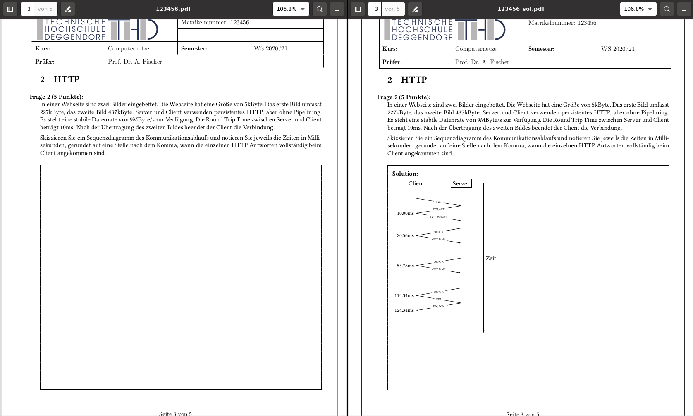

# exam-framework

A LaTeX/Python-based framework to create individualized Take-Home exams.

It is a significant extension of my LaTeX exam framework available in my
[LaTeX template repository](https://mygit.th-deg.de/afischer/thd-latex-vorlagen) and is based heavily on the [LaTeX exam class](https://www.ctan.org/pkg/exam).

## Requirements

The main requirements are a reasonable LaTeX setup and Python (3) for the
dynamic parts.  A makefile is used to streamline the LaTeX compilation process.

## Usage

Generate an example by calling `python generate.py` in the `exam` folder.
Results will be put in the `out` folder.

Create new dynamic questions by creating a new LaTeX file in `tex_base`,
including it in `exam.tex` and creating an accompanying Python script in
the `generators` directory. Python modules in this directory are expected
to have a function `generate(rng)`, where `rng` is filled with the seeded
Random Number Generator by the `generate.py` script. Don't forget to set
exam metadata (time, duration, etc.) in the `exam.tex` file.
See the provided examples for more information.

## Example

## Customization

The overall layout is based on [THD](https://www.th-deg.de) requirements.
To modify the layout have a look in particular
at `thdstyle.tex` and `titlepage.tex` in the `tex_base` folder.

Suggestions, remarks and constructive criticism are very welcome. HTH

---
© 2021 [Andreas Fischer](mailto:andreas.fischer@th-deg.de)
